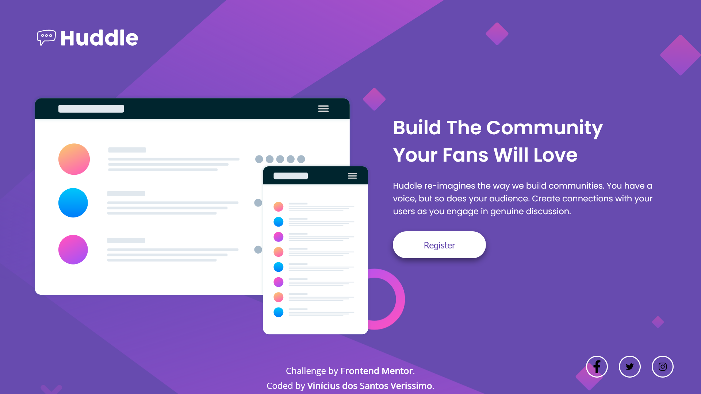

# Frontend Mentor - Huddle landing page solution

## Overview

### Screenshot

### Links

- Solution URL: https://viniciusdsv93.github.io/Huddle-landing-page/

## My process

### Built with

- Semantic HTML5 markup
- CSS custom properties
- Flexbox
- Media Queries

### What I learned

In this project i could use use media queries to adapt the containers according to the screen's width.

## Author

- GitHub - Vinícius dos Santos Verissimo (https://github.com/viniciusdsv93)
